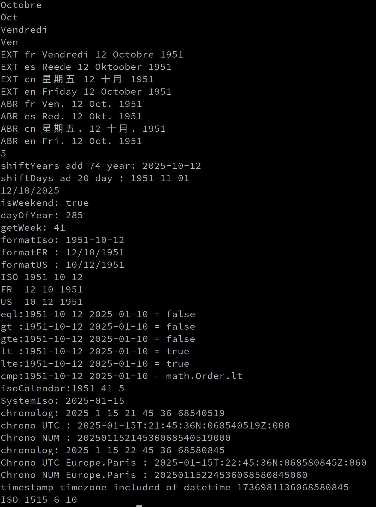

# Zig Datetime


## Table of Contents

- [Usage](#usage)
  - [Outils](#outils)
  - [Date-time](#dtime)
  - [Date](#date)
  - [Timezone](#dimezone)
  - [Translate](#dranslate)
- [Notes](#notes)
- [Avancement](#avancement)


## Usage
</br>

```zig

pub const Dte = @import("datetime").Date;   // work date Y M D

pub const Dtm = @import("datetime").DTime;  // UTC chronolog

pub const tmz = @import("timezones");       // Time zones


const allocator = std.heap.page_allocator;
const date = try Dte.create(2019, 12, 25);
const next_year = date.shiftDays(7);
assert(next_year.year == 2020);
assert(next_year.month == 1);
assert(next_year.day == 1);
or
const datuday= try. nowDate(tmz.Europe.Paris);  // get nanoTimestanp add timezones = YMD of day
  
// In UTC  nanoTimestamp
const nstamp = Dtm.nowTime(tmz.Europe.Paris);
std.debug.print("formaChrono UTC : {s}\n",.{nstamp.ChronoTime(allocator) catch "0" });
// Chrono UTC Europe.Paris : 2025-01-15T:22:56:28N:098450344Z:060
std.debug.print("formaChrono NUM : {d}\n",.{nstamp.ChronoNum(allocator) catch 0 });
// Chrono NUM Europe.Paris : 20250115225628098450344060

```
</br>
## Outils
</br>

|Function               | Description                              | Pub |
|-----------------------|------------------------------------------|-----|
|isLeapYear             | is Leap Year                             |  .  |
|dayInYear              | Number of days in the year               |  .  |
|daysInMonth            | Number of days in the month              |  .  |
|daysBeforeYear         | Number of days before Jan 1st of year    |  .  |
|daysBeforeMonth        | Number of days of the month precedent    |  .  |
|ldaysBeforeFirstMonday | Calculate the number of days of the first|  .  |
|                       | Monday for week 1 ISO calendar           |     |
|                       | for the given year since 01-Jan-0001     |     |
|ymd2ord                | Number of days since 01-Jan-0001         |     |

</br>

##Dtime
</br>

|Function               | Description                              | Pub |
|-----------------------|------------------------------------------|-----|
|HardTime               | Change of field attribute                |  .  |
|nowUTC                 | Timestamp date in UTC ONLY               |  x  |
|nowTime                | Timestamp date into Time-zone            |  x  |
|Timestamp              | Date time reverse  timestamp             |  x  |
|Timestamp              | Timestamp date into time-zone            |  x  |
|stringTime             | Date-time format string                  |  x  |
</br>

##Date
</br>

|Function    | Description                                          | Pub |
|------------|------------------------------------------------------|-----|
|create      | Create and validate the date    create DATE          |  x  |
|copy        | Return a copy of the date                            |  x  |
|fromOrdinal | Create a Date since 01-Jan-0001                      |  .  |
|toOrdinal   | Return proleptic Gregorian ordinal                   |  .  |
|HardDate    | Change of field attribute                            |  .  |
|nowDate     | Returns today's date into time-zone  create DATE     |  x  |
|isoCalendar | Convert to an ISO Calendar date YWS                  |  x  |
|eql         | comparaison                                          |  x  |
|comp        | comparaison                                          |  x  |
|gt          | comparaison                                          |  x  |
|gte         | comparaison                                          |  x  |
|lt          | comparaison                                          |  x  |
|lte         | comparaison                                          |  x  |
|parseIso    | Parse date in format YYYY-MM-DD  create DATE         |  x  |
|parseFR     | Parse date in format DD-MM-YYYY  create DATE         |  x  |
|parseUS     | Parse date in format MM-DD-YYYY  create DATE         |  x  |
|stringIso   | Return date in ISO format YYYY-MM-DD                 |  x  |
|stringFR    | Return date in FR  format DD-MM-YYYY                 |  x  |
|stringUS    | Return date in US  format MM-DD-YYYY                 |  x  |
|dayOfYear   | Return day of year starting with 1                   |  x  |
|dayOfWeek   | Day of week starting with Monday =1 and Sunday =7    |  x  |
|weekday     | Day of week starting with Monday =1 and Sunday =6    |  x  |
|dayNum      | Day of week starting with Monday =1 and Sunday =7    |  x  |
|getYear     | get year                                             |  x  |
|getMonth    | get Month                                            |  x  |
|getWeek     | get Week                                             |  x  |
|shiftDays   | Copy of the DATE shifted by the given number of days |  x  |
|shiftYears  | Copy of the DATE shifted by the given number of Year |  x  |
</br>

##Translate
</br>

|Function    | Description                                          | Pub |
|------------|------------------------------------------------------|-----|
|abbrevDay   | Return the abbreviation name of the day              |  x  |
|nameDay     | Return the of the day                                |  x  |
|abbrevMonth | Return the abbreviation name of the Month            |  x  |
|abbrevDay   | Return the abbreviation name of the day              |  x  |

</br>

```
   pub const Idiom = enum(u4) {
        en, // English
        fr, // French
        sp, // Spanish
        po, // Portuguese
        it, // Italian
        de, // German
        ne, // Netherlands
        fi, // finland
        gr, // Greece
        so, // Slovakia
        lu, // Lutuania
        es, // Estonia
        pl, // Poland
        ro, // Romania
        cn, // china
        co, // Korean
        jp, // Japan
        ru, // Russia
    };
```

</br>



</br>
##Notes
</br>

thank :  [ 

I needed a chronolog and a date of the day and date extended when other English, so I adapted the code to my needs 


</br>
The datetime module is divided into 3 parts,</br>
TIME : corresponds to the timestamp for a chronolog in milliseconds.</br>
DATE : corresponds to date management YMD</br>
TIMEZONE: corresponds to the time offset from UTC</br>
</br>
two ways to create a date :</br>
Create date free YMD format </br>
nowDate, which generates a current date by itself, incorporating the time zone </br>

</br>
</br>
</br>
</br>
#Avancement
</br>
→ 2025-01-14 22:45<BR/>
setting up the project date 
