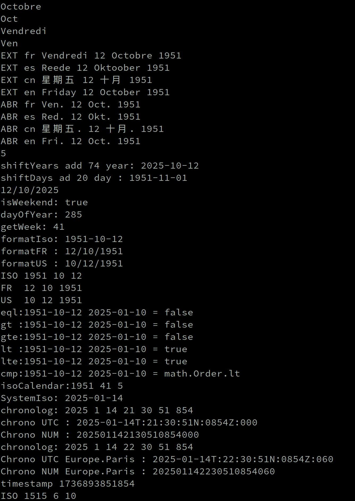
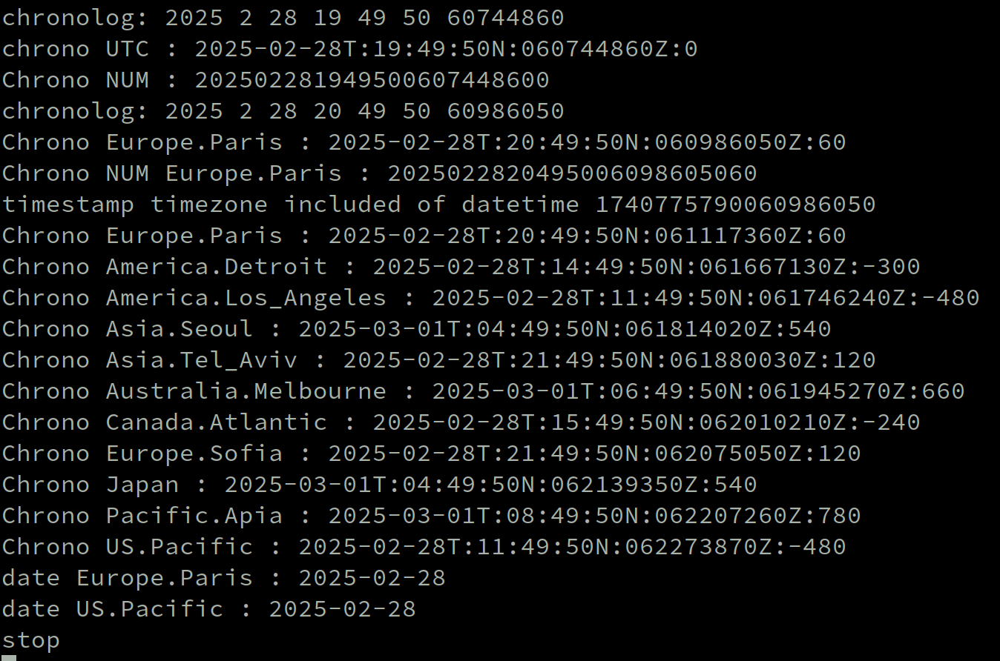

**attention I use the night version *


# Zig Datetime

thank

[


## Table of Contents

- [Usage](#usage)

    - [Outils](#outils)

    - [DateTime](#datetime)

    - [Date](#date)

    - [Timezone](#timezone)

    - [Notes](#notes)

    - [Avancement](#avancement)


## Usage

```zig

pub const Dte = @import("datetime").Date;  // work date Y M D

pub const Dtm = @import("datetime").DTime;  // UTC chronolog

pub const tmz = @import("timezones");       // Time zones


const allocator = std.heap.page_allocator;
const date = try Dte.create(2019, 12, 25);
const next_year = date.shiftDays(7);
assert(next_year.year == 2020);
assert(next_year.month == 1);
assert(next_year.day == 1);
const datuday= try. now(tmz.Europe.Paris);  // get milliTimestanp add timezones = YMD of day
  
// In UTC  milliTimestamp
const now = Dtm.now(tmz.Europe.Paris);
std.debug.print("formaChrono UTC : {s}\n",.{c.ChronoTime(allocator) catch "0" });
// formaChrono UTC : 2025-01-14T:11:25:37N:0491Z:000
std.debug.print("formaChrono NUM : {d}\n",.{c.ChronoNum(allocator) catch 0 });
// formaChrono NUM : 202501141125370491000

```
<br/>

## Notes  

<br/>
the time zone initialization process is performed once after each boot and only at the first function call. This is a principle used on the AS400 during OPDP (OPEN-DATA-SPACE).<br/>
<br/>
This is a standard date processing library, plus a feature for SQL that supports a NULL zone.<br/>
See examples in the zig_sql project.<br/>

In SQL, there are two ways of handling dates:<br/>
“NULL”, e.g. invoicing not processed.<br/>


“0000-00-00” is not a valid date, it's just an indication, you shouldn't use it in your SQL.<br/>

The date becomes invalid, for example when a record is “deinit”. <br/>
Dte.DATE.dateOff(&dfacture), becomes “0000-00-00” its status changes to false.<br/>

Normally, if you don't fiddle with the date apart from retrieving twisted text,<br/>
there'll be no error, catch unreachable instead of tryv

To regenerate the timezone.zig file, run gensrc.sh from the create_timezones folder.<br/>
this file is generated from timedatectl <br/>

isBad The “isBad” function checks for consistent date completeness<br/>

If you use an uninitialized or already uninitialized field, or isBad this will trigger an @panic error.  --> CRTL<br/>


To be dynamic, an LMDB file is generated at each reboot only if the readTimezone() function is used.<br/>

Time-zone processing in source file ./liboffset/timeoffset.zig<br/>

searchWeek” is a function that determines the number of weeks, the last week and the start of week 01.<br/>

<br/>







<br/>

## Outils

|Function               | Description                              | Pub |
|-----------------------|------------------------------------------|-----|
|checkLeapYear          | is Leap Year                             |  .  |
|dayInYear              | Number of days in the year               |  .  |
|daysInMonth            | Number of days in the month              |  .  |
|daysBeforeYear         | Number of days before Jan 1st of year    |  .  |
|daysBeforeMonth        | Number of days   of the month precedent  |  .  |
|isFile                 | openfileAbsolute lmdb                    |  .  |


## DateTime


|Function               | Description                              | Pub |
|-----------------------|------------------------------------------|-----|
|HardTime               | Change of field attribute                |  .  |
|nowUTC                 | Timestamp date in UTC ONLY               |  x  |
|nowTime                | Timestamp date into Time-zone            |  x  |
|Timestamp              | Date time reverse  timestamp             |  x  |
|NumTime                | Timestamp date into time-zone            |  x  |
|stringTime             | Date-time format string                  |  x  |


## Date

|Function    | Description                                          | Pub |Panic|ctrl|
|------------|------------------------------------------------------|-----|-----|----|
|create      | Create and validate the date                         |  x  |  ?  |    |
|dateOff     | Change status OFF for work SQL = null                |  x  |     |    |
[isBad       | Consistency test of the date                         |  .  [  *  |    |
|copy        | Return a copy of the date                            |  x  |  x  | x  |
|HardDate    | Change of field attribute                            |  .  |     |    |
|nowDate     | Returns today's date into time-zone   readTimezone() |  x  |     |    |
|eql         | comparaison                                          |  x  |     | x  |
|comp        | comparaison                                          |  x  |     | x  |
|gt          | comparaison                                          |  x  |     | x  |
|gte         | comparaison                                          |  x  |     | x  |
|lt          | comparaison                                          |  x  |     | x  |
|lte         | comparaison                                          |  x  |     | x  |
|parseIso    | Parse date in format YYYY-MM-DD                      |  x  |  x  |    |
|parseFR     | Parse date in format YYYY-MM-DD                      |  x  |  x  |    |
|parseUS     | Parse date in format YYYY-MM-DD                      |  x  |  x  |    |
|string      | Return date in ISO format YYYY-MM-DD                 |  .  |     | x  |
|stringFR    | Return date in ISO format DD-MM-YYYY                 |  .  |     | x  |
|stringUS    | Return date in ISO format MM-DD-YYYY                 |  .  |     | x  |
|getYear     | get year                                             |  x  |     |    |
|getMonth    | get Month                                            |  x  |     |    |
|getDay      | get Day                                              |  x  |     |    |
|getWeek     | get Week                                             |  x  |     |    |
|getWeekDay  | get WeekDay                                          |  x  |     |    |
|restOfdays  | get restOfdays                                       |  x  |     |    |
|isWeekend   | Test Week end                                        |  x  |     |    |
|isLeapYear  | is Leap Year                                         |  x  |     |    |
|dayNum      | number of days                                       |  .  |     |    |
|daysMore    | Add days                                             |  x  |     | x  |
|daysLess    | Sub days                                             |  x  |     | x  |
|yearsMore   | Add years                                            |  x  |     | x  |
|yearsLess   | Sub years                                            |  x  |     | x  |
|quantieme   | Returns the day number in the year                   |  x  |     | x  |
|dayZeller   | Calculation of day number with Sunday = 01...        |  .  |     |    |
|searchWeek  | Calculation week                                     |  .  |     |    |
|fromOrdinal | Create a Date since 01-Jan-0001                      |  .  |  x  |    |
|toOrdinal   | Return proleptic Gregorian ordinal                   |  .  |     |    |


## Timezone

|Function    | Description                                          | Pub |Panic|
|------------|------------------------------------------------------|-----|-----|
|abbrevDay   | Return the abbreviation name of the day              |  x  |     |
|nameDay     | Return the of the day                                |  x  |     |
|abbrevMonth | Return the abbreviation name of the Month            |  x  |     |
|abbrevDay   | Return the abbreviation name of the day              |  x  |     |

## Avancement

-2025-01-16 06:30 start projet date-time <br/>

-2025-01-16 15:01 add function switchMonths <br/>

-2025-01-30 04:47 Formatting @panic and modifying isBad() deleting assert() <br/>

-2025-02-25 20:08 Complete overhaul of the DATE model <br/>

-2025-02-25 20:08 Dynamic timezone set-up <br/>

-2025-02-25 20:08 Automatic creation of timezone.zig source code, via the module: Creat_timezones <br/>

-2025-02-25 20:08 LMDB database creation <br/>

-2025-02-25 20:08 module timeoffset  <br/>

-2025-03-10 16:40 Resuming diagnostics with the better-understood 0.14.0 @src deciphering  
  
-2025-03-14 16:10 module timeoffsetAdd arena-allocator , standardization with string and decimal  <br/>


 @panic  <br/>  
  
-2025-08.22  02:10  update zig 0.15.1

<br/>  
  
-2025-11.05  17:09  update zig 0.16.dev remove std.time.nanoTimestamp()<br/>  
  
-2025-11.06  13:36  Modification after a request for help in the Zig forum, more standard module retrieve nanoseconde <br/>  

